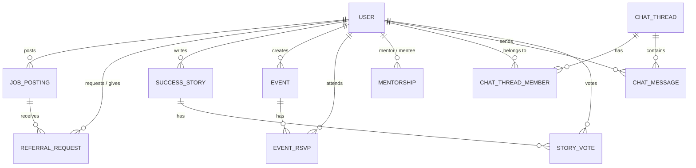

# Data Model & Entity-Relationship Diagram (ERD)

This document outlines the core data structures powering PRO ALUMN.

## Entity-Relationship Diagram

## Core Models

### 1. User
The central entity for all roles.
*   **Fields:** `id`, `name`, `email`, `passwordHash`, `role` (ADMIN, ALUMNI, STUDENT, FACULTY), profile data (`batchYear`, `department`, `currentCompany`), and `embedding` (for AI matching).

### 2. JobPosting & ReferralRequest
Handles the career pipeline.
*   **JobPosting:** `title`, `company`, `location`, `jobType`, `referralSlots`, `status`.
*   **ReferralRequest:** Links a `User` (Student) to a `JobPosting` and a `User` (Alumni). Tracks `status` (PENDING, ACCEPTED, REFERRED, HIRED).

### 3. Mentorship
Facilitates 1:1 guidance.
*   **Mentorship:** Links a `studentId` to a `mentorId`. Tracks `area` (e.g., "Career Advice") and `status`.

### 4. Chat System
*   **ChatThread:** Represents a conversation room (1:1 or Group).
*   **ChatThreadMember:** Junction table linking `User` to `ChatThread`.
*   **ChatMessage:** The actual messages linked to a `ChatThread` and a sender (`User`).

### 5. SuccessStory & Votes
*   **SuccessStory:** Alumni achievements (`title`, `story`, `company`, `upvoteCount`).
*   **StoryVote:** Ensures users can only vote once per story (links `User` to `SuccessStory`).
