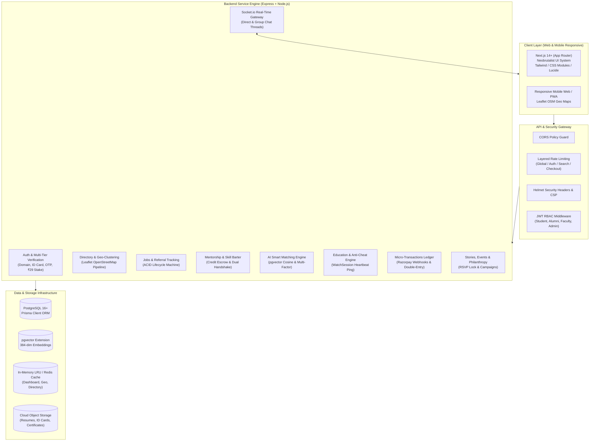
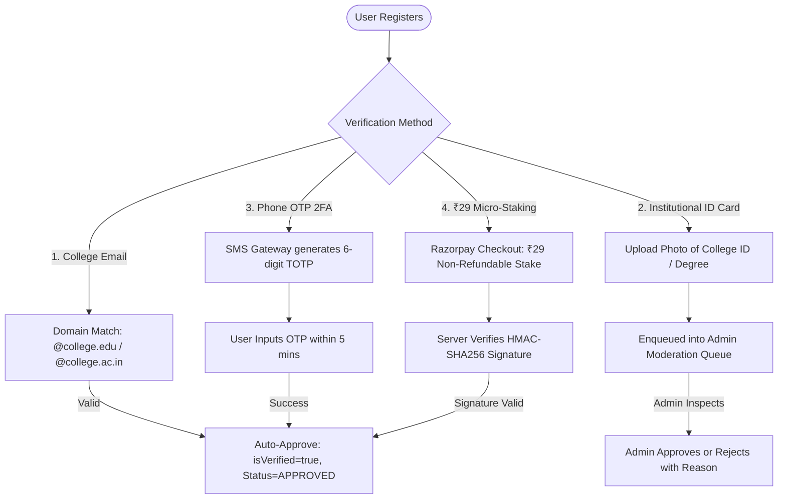
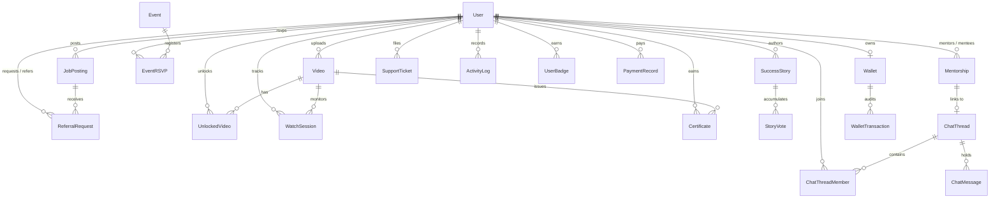
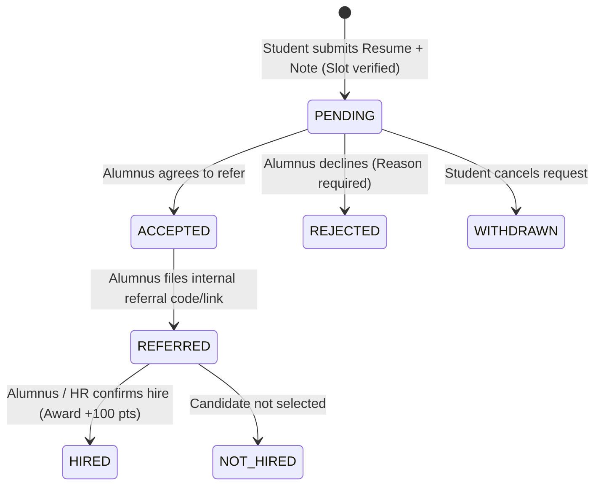
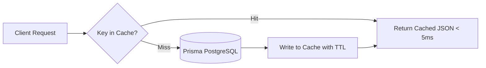
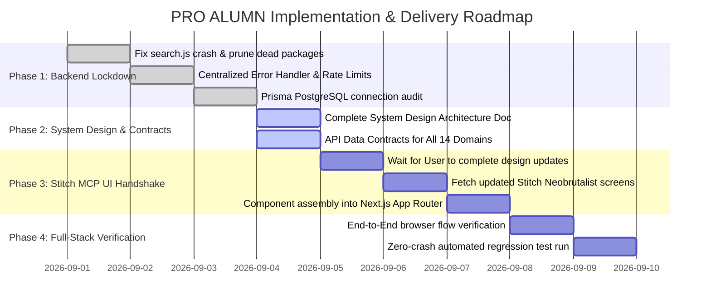

# PRO ALUMN (Alumnia) — Comprehensive System Design Document
**Platform:** Next.js (App Router) + Node.js / Express + PostgreSQL (Prisma ORM + pgvector) + Socket.io + Leaflet OSM  
**Scope:** Complete End-to-End System Design for All Features (Legacy, Core & Newly Introduced)  
**Status:** Approved Architecture & Specification Draft  
**Version:** 3.0.0  

---

## 1. Executive Architecture Summary & Core Tenets

PRO ALUMN is an enterprise-grade institutional network and career ecosystem designed for universities, colleges, and alumni associations. It unifies alumni discoverability, peer mentorship, career referrals, anti-cheat video education, institution philanthropy, and administrative moderation into a single cohesive platform.



### Core Architecture Tenets
1. **Zero Direct-DB Access from Frontend:** The Next.js frontend interacts *exclusively* via REST endpoints (`/api/*`) and WebSocket channels. Frontend code never imports Prisma directly, preserving connection pool hygiene, enforcing RBAC, and isolating the database tier.
2. **ACID Transaction Integrity:** Financial ledger movements (wallets, escrow), referral quota decrements, and event RSVPs execute strictly inside transactional boundaries (`prisma.$transaction`) with row-level safety.
3. **Idempotency & Dual-Handshake Agreements:** Mentorship completions and payment webhooks require strict cryptographic signature verification and dual-confirmation handshakes before releasing funds.
4. **Resilient Sub-100ms P95 Performance:** All high-frequency endpoints (Directory, Global Search, Dashboard stats, Geo-clusters) leverage in-memory cache-aside layers with dynamic cache invalidation on mutations.
5. **Anti-Cheat Verification:** Learning credentials and certificates cannot be claimed by skipping or spoofing progress; video consumption is continuously verified through an encrypted, monotonic heartbeat ping protocol.

---

## 2. Role-Based Access Control (RBAC) & Identity Governance

The system enforces strict permission boundaries across four distinct user personas:

| Capability / Module | Student | Alumni | Faculty | Administrator |
|---|:---:|:---:|:---:|:---:|
| **Browse Alumni Directory & Geo-Map** | Read-Only | Full Access | Full Access | Full Access |
| **Request Job Referrals** | Create (1/job) | Receive & Process | View Stats | Audit / Moderate |
| **Post Job Openings** | ❌ | Create & Manage | View Only | Create & Manage |
| **Mentorship Hub (Request / Session)** | Requestee | Mentor / Skill Swap | Advisory | Moderate / Triage |
| **Credit Escrow & Barter Swaps** | Escrow Payer | Earner / Swapper | ❌ | Ledger Audit |
| **Submit Success Stories** | Read / Upvote | Create Stories | Moderate | Approve & Feature |
| **Events & Reunions** | RSVP (Attendee) | Host & RSVP | Host & RSVP | Full Control |
| **Faculty Announcements** | Read-Only | Read-Only | Create & Publish | Create & Publish |
| **Institutional Newsletters** | Read-Only | Read-Only | Read-Only | Upload & Publish |
| **Education Video Masterclasses** | Unlock & Learn | Upload & Earn | Create Content | Review & Publish |
| **Giving & Philanthropy** | View Campaigns | Donate / Pledge | View Progress | Create & Manage |
| **Verification & Moderation Queue** | ❌ | ❌ | View Batch | Approve / Reject |
| **CSV Bulk Class Onboarding** | ❌ | ❌ | Batch Import | Batch Import |
| **CMS Custom Page Builder** | View Pages | View Pages | View Pages | Full Layout Edit |

### Multi-Tier Verification Pipeline
To guarantee trust across alumni listings and corporate referral access, accounts must complete one of four verified trust gates:



---

## 3. Core Domain Models & Database Schema (PostgreSQL + pgvector)

The relational architecture is optimized for read performance, referential integrity, and vector semantic querying.



### Complete Schema Definitions

#### 1. Identity & Profile Core
* **`User`**: Core identity table.
  * Fields: `id` (UUID), `name`, `email` (unique), `passwordHash`, `role` (enum: `ADMIN`, `ALUMNI`, `STUDENT`, `FACULTY`), `profileStatus` (enum: `INCOMPLETE`, `PENDING`, `APPROVED`, `REJECTED`), `phone`, `avatarUrl`, `resumeUrl`, `verificationMethod`, `idCardUrl`, `rejectionReason`.
  * College Meta: `batchYear` (Int), `department` (VarChar), `rollNumber` (VarChar).
  * Career Meta: `currentCompany`, `jobTitle`, `location`, `linkedinUrl`, `bio`.
  * Matching & Vector: `skills` (comma-separated), `skillsOffered`, `skillsWanted`, `interests`, `embedding` (`vector(384)` pgvector embedding for semantic search).
  * Gamification: `currentStreak`, `longestStreak`, `lastActiveDate`, `totalPoints`, `profileCompleteness`.

#### 2. Jobs & Referral Engine
* **`JobPosting`**: Job and internship listings.
  * Fields: `id`, `postedById` (FK User), `title`, `company`, `location`, `jobType` (`FULL_TIME`, `INTERNSHIP`, `CONTRACT`), `experienceLevel` (`ENTRY`, `MID`, `SENIOR`), `description`, `requirements`, `skills`, `salaryMin`, `salaryMax`, `currency`, `applyLink`, `deadline`, `referralSlots` (Max allowed referrals), `status` (`OPEN`, `CLOSED`, `EXPIRED`), `viewsCount`.
* **`ReferralRequest`**: Formal referral tracking lifecycle.
  * Fields: `id`, `jobId` (FK JobPosting), `requestedById` (FK User - Student), `referredById` (FK User - Alumni), `resumeUrl`, `coverLetter`, `studentNote`, `alumniNote`, `rejectionReason`, `status` (enum: `PENDING`, `ACCEPTED`, `REJECTED`, `REFERRED`, `HIRED`, `NOT_HIRED`, `WITHDRAWN`), `referredAt`, `finalOutcomeAt`.
  * Constraints: `@@unique([jobId, requestedById])` (Prevents duplicate spam requests).

#### 3. Mentorship & Skill Swap
* **`Mentorship`**: 1:1 mentorship and barter sessions.
  * Fields: `id`, `studentId` (FK User), `mentorId` (FK User), `area`, `message`, `status` (enum: `PENDING`, `ACCEPTED`, `DECLINED`, `COMPLETED`, `DISPUTED`), `creditsCharged` (Default: 0), `chatThreadId` (FK ChatThread), `isCompleted`, `isDirectSwap` (Boolean: true for 0-credit barter), `scheduledFor` (DateTime), `durationMins`, `studentConfirmed` (Boolean), `mentorConfirmed` (Boolean).
  * Constraints: `@@unique([studentId, mentorId])`.

#### 4. Real-Time Chat & Collaboration
* **`ChatThread`**: Chat container for 1:1 or group channels.
  * Fields: `id`, `name`, `isGroup` (Boolean), `createdAt`, `updatedAt`.
* **`ChatThreadMember`**: Membership join table.
  * Fields: `id`, `threadId` (FK ChatThread), `userId` (FK User), `joinedAt`.
* **`ChatMessage`**: Immutable message log.
  * Fields: `id`, `threadId` (FK ChatThread), `senderId` (FK User), `text`, `createdAt`.

#### 5. Gamification, Streaks & Badges
* **`ActivityLog`**: Granular activity tracking.
  * Fields: `id`, `userId` (FK User), `actionType` (`DAILY_LOGIN`, `POSTED_JOB`, `REFERRAL_GIVEN`, `STORY_POSTED`, `MENTORSHIP_COMPLETED`), `pointsEarned`, `createdAt`.
* **`Badge`**: Master badge catalog (`id`, `name`, `description`, `imageUrl`, `requiredPts`).
* **`UserBadge`**: Unlocked badges (`id`, `userId`, `badgeId`, `earnedAt`).

#### 6. Education, Video Masterclasses & Anti-Cheat
* **`Video`**: Educational content uploaded by alumni/faculty.
  * Fields: `id`, `title`, `description`, `videoUrl`, `priceInCredits`, `durationSeconds`, `status` (`PROCESSING`, `PENDING`, `PUBLISHED`, `REJECTED`), `uploaderId` (FK User).
* **`UnlockedVideo`**: User access entitlement table.
  * Fields: `id`, `userId`, `videoId`, `watchedSeconds`, `completedAt`, `createdAt`.
* **`WatchSession`**: Anti-cheat heartbeat tracker.
  * Fields: `id`, `userId`, `videoId`, `maxWatchedTimestamp` (Float), `lastHeartbeat` (DateTime), `status` (`WATCHING`, `COMPLETED`).
* **`Certificate`**: Accredited course completion credentials.
  * Fields: `id`, `certificateUrl` (S3/Cloudinary PDF), `userId`, `videoId`, `pointsDeducted`, `issuedAt`.

#### 7. Virtual Wallet, Micro-Transactions & Institutional Giving
* **`Wallet`**: User credit wallet (`id`, `userId` unique, `balance`, `updatedAt`).
* **`WalletTransaction`**: Immutable double-entry financial ledger.
  * Fields: `id`, `walletId`, `userId`, `amount`, `reason`, `type` (enum: `CREDIT`, `DEBIT`, `MENTORSHIP_ESCROW`, `MENTORSHIP_EARNED`, `ESCROW_REFUND`, `REFERRAL_REWARD`, `VIDEO_COMPLETED`, `CERTIFICATE_CLAIM`), `description`, `createdAt`.
* **`PaymentRecord`**: Gateway audit log (`id`, `userId`, `amount`, `currency`, `razorpayOrderId`, `razorpayPaymentId`, `razorpaySignature`, `status`).
* **`GivingCampaign`** *(New Feature)*: Institutional philanthropy and crowdfunding.
  * Fields: `id`, `title`, `category` (`SCHOLARSHIP`, `INFRASTRUCTURE`, `LAB_EQUIPMENT`, `RESEARCH`), `targetAmount`, `raisedAmount`, `startDate`, `endDate`, `status` (`ACTIVE`, `COMPLETED`), `createdById`.
* **`DonationPledge`** *(New Feature)*: Individual contributions.
  * Fields: `id`, `campaignId` (FK GivingCampaign), `donorId` (FK User), `amount`, `isAnonymous`, `receiptUrl`, `paymentId`, `createdAt`.

#### 8. Community Engagement & Institutional CMS
* **`Event` & `EventRSVP`**: Institutional gatherings, webinars, and reunions. Capacity constraints handled via row-level locks.
* **`SuccessStory` & `StoryVote`**: Spotlight Wall featuring alumni journeys with upvote deduplication.
* **`Announcement`**: Broadcast alerts authored by faculty and administrators.
* **`Newsletter`**: Digital archives of college magazines and placement reports.
* **`SitePage`**: Dynamic CMS custom pages structured as JSON blocks (`hero`, `features`, `stats`, `faq`, `cta`).
* **`SupportTicket`**: Grievance redressal and query management system (`OPEN`, `IN_PROGRESS`, `RESOLVED`, `CLOSED`).

---

## 4. End-to-End Functional Systems & Algorithmic Pipelines

### 4.1 Feature 1: Verified Alumni Directory & Leaflet OpenStreetMap Geo-Map
* **Objective:** Enable multi-facet discovery of alumni across cohorts, departments, tech stacks, and global coordinates.
* **Geo-Distribution Pipeline:**
  1. Alumni profiles store structured city/country and resolved latitude/longitude coordinates upon profile update.
  2. The endpoint `GET /api/users/geo-distribution` aggregates coordinates within geographical clusters.
  3. Response delivers geoJSON-compatible cluster payloads with alumnus metadata markers for Leaflet OpenStreetMap rendering.
* **Algorithmic Search:** Implements tokenized search splitting queries into tokens (e.g. `"Google SDE Bangalore"`) and querying indexed columns `currentCompany`, `jobTitle`, `department`, and `location` using ILIKE clauses with bounded limit/offset pagination.

### 4.2 Feature 2: Career & Referral Lifecycle Hub
* **Objective:** Transform casual referral requests into a transparent, accountable, institutionally auditable pipeline.
* **Lifecycle State Machine:**



* **Slot Integrity Protection:** When an alumnus creates a job posting with `referralSlots: N`, active pending requests cannot exceed $2 \times N$, preventing candidate flooding. When a candidate transitions to `REFERRED`, `referralSlots` decrements atomically.

### 4.3 Feature 3: Mentorship Hub, Skill Swap & Credit Escrow Engine
* **Objective:** Bridge the experience gap through 1:1 sessions, either via direct barter (Skill Swap) or virtual credit escrow.
* **Skill Barter Matching Algorithm:**
  $$\text{MatchScore}(A, B) = \frac{|\text{SkillsOffered}_A \cap \text{SkillsWanted}_B| + |\text{SkillsOffered}_B \cap \text{SkillsWanted}_A|}{|\text{SkillsWanted}_A \cup \text{SkillsWanted}_B|}$$
  If a mutual bidirectional skill exchange is detected, the session is flagged as `isDirectSwap: true` (0 credit cost).
* **Dual-Handshake Escrow Pipeline:**
  1. Student requests mentorship session with $K$ credits fee.
  2. System checks `Wallet.balance >= K` inside a transaction, creates `WalletTransaction(type: MENTORSHIP_ESCROW, amount: -K)`, and decrements student balance.
  3. Session is held.
  4. Both student and mentor must submit completion verification (`studentConfirmed = true` and `mentorConfirmed = true`).
  5. Upon dual confirmation, system creates `WalletTransaction(type: MENTORSHIP_EARNED, amount: +K)` crediting mentor's wallet.
  6. If declined or canceled before session, escrow is refunded automatically (`ESCROW_REFUND`).

### 4.4 Feature 4: AI Smart Matching Engine
* **Objective:** Deliver the "Top 5 Mentors / Alumni for You" recommendations for students without existing connections.
* **Dual-Engine Execution Strategy:**
  1. **Primary Vector Search (pgvector):**
     - User skills, bio, career history, and interests are concatenated and converted into a 384-dimensional vector embedding.
     - Database performs cosine distance calculation using the pgvector `<=>` operator:
       ```sql
       SELECT id, name, currentCompany, jobTitle, 
              1 - (embedding <=> $studentEmbedding::vector) AS similarity
       FROM "User"
       WHERE role = 'ALUMNI' AND "isVerified" = true
       ORDER BY embedding <=> $studentEmbedding::vector ASC
       LIMIT 5;
       ```
  2. **Fallback Heuristic Composite Scoring:**
     If vector embeddings are unpopulated, the algorithm falls back to a weighted composite equation:
     $$\text{Score} = 0.40 \times J(\text{Skills}_S, \text{Skills}_A) + 0.30 \times J(\text{Interests}_S, \text{Interests}_A) + 0.20 \times \delta(\text{Dept}_S, \text{Dept}_A) + 0.10 \times \min(1, \frac{\text{Streak}_A}{30})$$
     Where $J(X, Y) = \frac{|X \cap Y|}{|X \cup Y|}$ is the Jaccard similarity coefficient.

### 4.5 Feature 5: Real-Time Unified Messaging System
* **Objective:** Provide secure, contextual 1:1 and group communications tied directly to mentorship and referral workflows.
* **Socket.IO Real-Time Architecture:**
  - Connection authentication via JWT handshake header.
  - Event taxonomy:
    - `join-thread(threadId)`: Room joining with membership verification.
    - `send-message({ threadId, text })`: Message persistence in DB + broadcast to room.
    - `new-message(messagePayload)`: Client push event with optimistic UI rendering.
    - `typing-indicator({ threadId, isTyping })`: Transient presence feedback.
    - `message-read({ threadId, messageId })`: Read receipt updates.

### 4.6 Feature 6: Education Center & Anti-Cheat Watch Engine
* **Objective:** Allow alumni to monetize tech masterclasses while guaranteeing legitimate student watch time before certificates are issued.
* **Anti-Cheat Protocol:**
  ```mermaid
  sequenceDiagram
    autonumber
    actor Student
    participant Browser as Client Video Player
    participant Server as Anti-Cheat API (/api/video/heartbeat)
    participant DB as WatchSession Record

    Student->>Browser: Starts Video Playback
    Browser->>Server: Heartbeat Ping (currentTime: 10s)
    Server->>DB: Validate (10s <= maxWatched + 12s) -> Update maxWatched = 10s
    Server-->>Browser: 200 OK (Heartbeat Confirmed)
    
    Note over Student,Browser: Student attempts scrub/skip to 45:00!
    Browser->>Server: Heartbeat Ping (currentTime: 2700s)
    Server->>DB: Check (2700s > maxWatched 10s + 12s)
    Server-->>Browser: 400 CHEAT_DETECTED (Flagged & Reset to 10s)
  ```
* **Certificate Claim Gate:** Student can only call `POST /api/video/:id/certificate` when `maxWatchedTimestamp >= 0.90 * durationSeconds`.

### 4.7 Feature 7: Gamification, Streaks & Point Allocation Engine
* **Objective:** Maximize daily platform retention across student and alumni cohorts.
* **Streak Lifecycle:**
  - Daily active window: Normalized UTC calendar day.
  - Grace Period: 36 hours from previous active timestamp before streak resets to 1.
* **Point Allocation Matrix:**
  - Daily Platform Login: `+10 points`
  - Profile 100% Completion: `+50 points`
  - Alumni Referral Granted: `+100 points`
  - Candidate Marked Hired: `+250 points`
  - Mentorship Session Completed: `+75 points`
  - Publishing Approved Success Story: `+60 points`

### 4.8 Feature 8: Institutional Giving, Philanthropy & Crowdfunding (New Feature)
* **Objective:** Enable structured alumni endowment, department scholarships, and campus lab sponsorships.
* **Campaign Workflow:**
  - Admins create campaigns with target amounts and milestone progress.
  - Alumni contribute with transparent pledge tracking, optional donor anonymity, and automated tax receipt generation.
  - Real-time fundraising leaderboard by graduation batch (e.g. "Class of 2018 vs Class of 2019").

### 4.9 Feature 9: Events, Reunions & Concurrency-Safe RSVPs
* **Objective:** Host physical and virtual reunions with strict capacity enforcement.
* **Capacity Locking:**
  ```javascript
  await prisma.$transaction(async (tx) => {
    const event = await tx.event.findUnique({
      where: { id: eventId },
      include: { _count: { select: { rsvps: true } } },
    });
    if (event.maxCapacity && event._count.rsvps >= event.maxCapacity) {
      throw new AppError('EVENT_FULL', 'This event has reached maximum capacity', 409);
    }
    return tx.eventRSVP.create({ data: { eventId, userId } });
  });
  ```

### 4.10 Feature 10: Admin Command Center & Moderation Hub
* **Objective:** Single-pane-of-glass governance for institution staff.
* **Modules:**
  - **Verification Queue:** Table of pending alumni with uploaded ID card viewer, LinkedIn cross-reference, and one-click approve/reject actions.
  - **Batch CSV Import:** Streaming CSV processor with schema validation for roll numbers, graduation cohorts, and emails.
  - **Stories & Video Moderation:** Content review workflow with instant publish/reject toggles.
  - **Analytics Engine:** Visual KPI metrics: Placement Referral Conversion Rate, Top 10 Hiring Companies, Alumni Active Engagement Ratio.
  - **CMS Block Engine:** Visual page composition for institutional news, accreditation pages, and career day portals.

---

## 5. Comprehensive REST API Specification & Data Contracts

All endpoints conform to a standardized JSON response envelope:

```json
{
  "success": true,
  "data": {},
  "meta": {
    "pagination": { "total": 120, "page": 1, "limit": 20, "pages": 6 }
  }
}
```

Error response envelope:
```json
{
  "success": false,
  "code": "ERROR_CODE_IDENTIFIER",
  "message": "Human-readable descriptive error explanation."
}
```

### Complete API Surface Matrix

| Module | Method | Route | Description | Auth / Role |
|---|---|---|---|---|
| **Auth** | `POST` | `/api/auth/register` | Register student/alumni account | Public |
| | `POST` | `/api/auth/login` | Authenticate & issue JWT tokens | Public (Rate-limited) |
| | `POST` | `/api/auth/verify-otp` | Verify 2FA phone registration code | Authenticated |
| | `GET` | `/api/auth/me` | Fetch authenticated profile state | Authenticated |
| **Directory** | `GET` | `/api/users/alumni` | Search alumni directory with multi-facet filters | Authenticated |
| | `GET` | `/api/users/geo-distribution` | Leaflet OSM cluster coordinate dataset | Authenticated |
| | `GET` | `/api/users/:id` | Fetch public profile details | Authenticated |
| | `PUT` | `/api/users/profile` | Update bio, company, skills, coordinates | Authenticated (Owner) |
| **Jobs** | `GET` | `/api/jobs` | Browse active job & internship listings | Authenticated |
| | `POST` | `/api/jobs` | Post new job opening with referral slots | Alumni, Admin |
| | `GET` | `/api/jobs/:id` | View job details & referral status | Authenticated |
| | `DELETE` | `/api/jobs/:id` | Close or delete job listing | Owner, Admin |
| **Referrals**| `POST` | `/api/referrals` | Submit formal referral request | Student |
| | `GET` | `/api/referrals/my-requests` | List student's submitted requests | Student |
| | `GET` | `/api/referrals/incoming` | List alumnus's incoming requests | Alumni |
| | `PATCH`| `/api/referrals/:id/status` | Transition request status (`ACCEPTED`, etc.) | Assigned Alumni |
| **Mentorship**| `GET` | `/api/mentorship/mentors` | Search available mentors by area | Authenticated |
| | `POST` | `/api/mentorship/request` | Book 1:1 session (Escrow / Barter) | Student |
| | `PATCH`| `/api/mentorship/:id/respond` | Accept / decline mentorship booking | Mentor |
| | `POST` | `/api/mentorship/:id/confirm` | Dual-handshake session completion | Student, Mentor |
| **Matching** | `GET` | `/api/matching/top-alumni` | Get Top 5 AI Smart Matched profiles | Student |
| **Chat** | `GET` | `/api/chat/threads` | List user's active conversations | Authenticated |
| | `GET` | `/api/chat/threads/:id/messages`| Fetch paginated message history | Thread Member |
| | `POST` | `/api/chat/threads/:id/messages`| Send message via REST fallback | Thread Member |
| **Stories** | `GET` | `/api/stories` | View approved Spotlight Wall stories | Authenticated |
| | `POST` | `/api/stories` | Submit career journey success story | Alumni |
| | `POST` | `/api/stories/:id/vote` | Toggle upvote on story (idempotent) | Authenticated |
| **Events** | `GET` | `/api/events` | List upcoming online/offline events | Authenticated |
| | `POST` | `/api/events` | Create new reunion / masterclass event | Alumni, Faculty, Admin |
| | `POST` | `/api/events/:id/rsvp` | Concurrency-locked event reservation | Authenticated |
| **Video** | `GET` | `/api/video` | Browse masterclass video catalog | Authenticated |
| | `POST` | `/api/video/:id/unlock` | Unlock paywalled video with credits | Student |
| | `POST` | `/api/video/heartbeat` | Monotonic anti-cheat playback heartbeat | Student |
| | `POST` | `/api/video/:id/certificate` | Generate accredited completion PDF | Student (Verified) |
| **Giving** | `GET` | `/api/giving/campaigns` | List active endowment & scholarship funds | Authenticated |
| | `POST` | `/api/giving/pledge` | Submit donation pledge via Razorpay | Authenticated |
| **Wallet** | `GET` | `/api/wallet/balance` | Fetch credit balance & transaction log | Authenticated |
| | `POST` | `/api/wallet/topup` | Create Razorpay credit top-up order | Authenticated |
| | `POST` | `/api/wallet/webhook` | Process Razorpay payment confirmation | Gateway Webhook |
| **Admin** | `GET` | `/api/admin/pending-verifications` | Queue of unverified alumni | Admin |
| | `PATCH`| `/api/admin/verify-user/:id` | Approve / reject alumni with feedback | Admin |
| | `POST` | `/api/admin/bulk-import` | Streamed CSV alumni batch onboarding | Admin |
| | `GET` | `/api/admin/analytics` | Aggregated placement & network stats | Admin |
| | `POST` | `/api/pages` | Create dynamic CMS block site page | Admin |

---

## 6. Performance, Caching & Scalability Blueprint

### 6.1 In-Memory Cache-Aside Architecture
High-traffic, read-intensive endpoints utilize an in-memory TTL cache to protect database connection pools:
* **Directory Search (`/api/users/alumni`):** Cached by normalized query hash for `60s`.
* **Geo-Distribution (`/api/users/geo-distribution`):** Cached globally for `300s`, invalidated whenever an alumnus updates coordinates.
* **Dashboard Stats (`/api/admin/analytics`):** Cached for `180s`.



### 6.2 Layered Rate Limiting Protection
* **Global Limiter:** 200 requests per 15 minutes per IP.
* **Authentication Limiter:** 20 login/registration requests per 15 minutes.
* **Full-Text Search Limiter:** 60 queries per minute per user.
* **Checkout / Webhook Limiter:** 10 requests per 15 minutes.

### 6.3 Asynchronous Non-Blocking Email Pipeline
Emails (verification notices, referral alerts, mentorship confirmations) execute in background promises outside the request-response thread:
```javascript
// Immediate HTTP 200 response to client; email sent asynchronously in background
setImmediate(async () => {
  try {
    await sendTransactionalEmail({ to, subject, template });
  } catch (err) {
    logger.error('Background email dispatch failed:', err);
  }
});
```

---

## 7. Security, Privacy & Compliance Architecture

1. **Defense-in-Depth Injection Prevention:**
   - Database operations use Prisma ORM with strictly parameterized queries, neutralizing SQL injection vectors.
   - User-submitted HTML / Markdown is sanitized on ingest and escaped during SSR render.
2. **PII Isolation & Network Privacy:**
   - Phone numbers, personal email addresses, and uploaded resumes remain private. They are only exposed to another user once a mutual referral request or mentorship session is explicitly `ACCEPTED`.
3. **Cryptographic Webhook Verification:**
   - Razorpay payment webhooks validate payload signatures using HMAC-SHA256 with timing-safe string comparison before granting wallet credits or verifying users.
4. **JWT Hardening:**
   - Tokens signed with HS256 / RS256 with 15-minute access token lifespans and refresh rotation.

---

## 8. Frontend Design System Specification: Neobrutalism Design System

The visual design system of PRO ALUMN is defined by bold neobrutalist aesthetics:
* **Borders & Framing:** Thick, high-contrast borders (`3px solid #000000` / `border-black`).
* **Hard Drop Shadows:** Distinct geometric shadows without blur: `box-shadow: 4px 4px 0px #000000` (Hover: `box-shadow: 6px 6px 0px #000000` with tactile transform `translate(-2px, -2px)`).
* **Vibrant Color Palette:**
  * Primary Accent: Cyber Yellow (`#FFE600`)
  * Electric Cyan: (`#00F0FF`)
  * High-Visibility Orange: (`#FF5C00`)
  * Neon Emerald: (`#00E575`)
  * Hyper Violet: (`#9D00FF`)
  * Base Background: Off-white canvas (`#F8F9FA` or `#FFFDF5`)
* **Typography:** Bold grotesque sans-serif for headings (e.g. *Cabinet Grotesk*, *Space Grotesk*, or *Inter 900*) paired with clean monospace labels (*JetBrains Mono* / *Space Mono*).

---

## 9. Phased Delivery & Integration Plan



---

## 10. Verification & Quality Gates

To confirm the platform achieves production-readiness, every release must pass four quality gates:
1. **API Contract Integrity Gate:** Every endpoint in Section 5 must return strict HTTP status codes matching the envelope schema.
2. **ACID Concurrency Gate:** Multi-user RSVP and referral slot tests must never allow negative slots or oversold event capacities.
3. **Anti-Cheat Watch Gate:** Video watch sessions must fail closed when playback pings are skipped or scrubbed.
4. **Lint & Typecheck Gate:** Zero TypeScript compilation errors across `frontend/` and zero unhandled exceptions across `backend/`.
